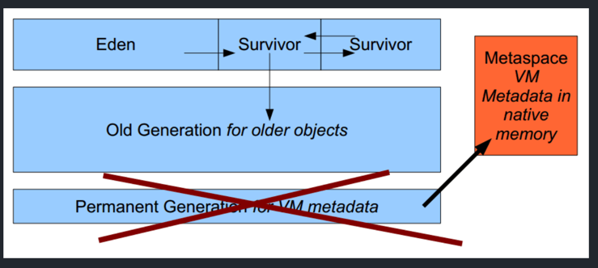

# 移除永久代
## 1、元空间，替代永久代，用来存储类元数据信息
* 空间变化示例图

## 2、参数影响
* PremGen空间完全移除，JVM参数PremSize和MaxPremSize会被忽略并给出警告
## 3、新增的Metaspace内存模型
  * 大多数元数据都在本地内存分配
  * 容量：默认情况下，类元数据只收本地内存的限制（取决于32位或者64位操作系统的可用虚拟内存大小）
  * 新参数MaxMetaspaceSize用用于限制本地内存分配给类元数据的大小。如果没有指定，元空间会在运行时根据需要动态调整
  * Metaspace垃圾回收
      * 对于僵死的类以类加载器的垃圾回收，在使用量到了MaxMetaspaceSize参数设定值时进行
      * 监控和调整元空间，对于减少垃圾回收频率和减少延时很有必要
      * 如果持续的元空间垃圾回收，说明存在类、类加载器导致的内存泄露或者大小设置不合适
  * Metaspace监控
    * 元空间使用情况可以从hotspot1.8的详细日志输出中得到
    * jstat和jVisualVM
# 4、对堆的影响
* 杂项数据移到java堆空间中。升级到JDK8之后，会发现Java堆空间有所增长
   
 